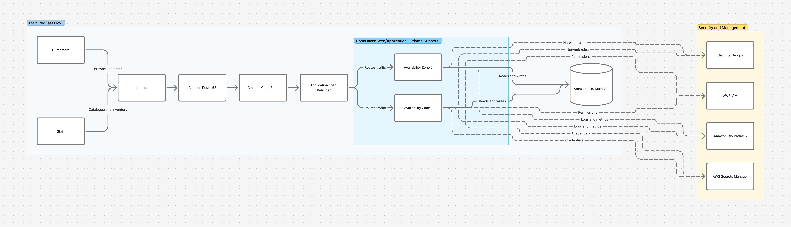

# Diagrams

This directory holds the exported architecture diagrams for BookHaven.

The diagrams are created and edited in **Figma**. Figma is the working source;
this directory holds the **exported images** so that the diagram can be viewed
in the repository, referenced from the documentation, and submitted for
assessment without needing a Figma account.

---

## Final architecture diagram

**Status:** placeholder — to be added.

**Figma file:** `https://www.figma.com/board/IdgZQlzcqfqZntz5PJtZpy`

Once exported, the diagram will be displayed here:

<!-- Replace this comment with the image once the export is committed:

-->

```
+---------------------------------------------------------------+
|                                                               |
|              PLACEHOLDER                                      |
|              BookHaven architecture diagram                   |
|                                                               |
|              To be exported from Figma and committed          |
|              as bookhaven-architecture-v1.png                 |
|                                                               |
+---------------------------------------------------------------+
```

---

## What the diagram must show

The diagram must match [`../docs/architecture.md`](../docs/architecture.md)
exactly. It must include:

- Customers and Staff, and the internet boundary.
- Route 53, then CloudFront, then the Application Load Balancer.
- EC2 Auto Scaling across **two Availability Zones**.
- Amazon RDS Multi-AZ, showing the primary and the standby.
- The **VPC** boundary, with public and private subnets clearly separated and
  labelled by Availability Zone.
- Security Groups, IAM, Secrets Manager and CloudWatch, positioned to show what
  they apply to.

Only the AWS services listed in the [README](../README.md) may appear. A service
shown in the diagram but absent from the documentation, or the reverse, is an
inconsistency that will be raised in review.

---

## Export conventions

**Format.** Export as **PNG** for viewing in the repository and in Markdown.
Also export a **PDF** if a print-quality version is required for submission.

**Resolution.** Export PNG at **2x** so the diagram remains readable when
enlarged. Text in the exported image must be legible without zooming.

**Naming.** Use lower-case, hyphenated names with an explicit version:

```
bookhaven-architecture-v1.png
bookhaven-architecture-v2.png
bookhaven-architecture-v2.pdf
```

Do not use `final`, `latest`, `new` or `updated` in file names. They stop being
accurate the moment the next version is exported.

**Versioning.** Increment the version number for each agreed revision and keep
previous versions in this directory. The history shows how the design developed,
which is useful evidence for the assessment. When a new version supersedes an
old one, update the reference in the documentation in the same pull request.

**Working files.** Figma `.fig` files are excluded by `.gitignore`. The Figma
file itself remains the source of truth for editing; only exports are committed.

---

## Updating the diagram

1. Open an issue describing the change and assign it to yourself.
2. Confirm the change is consistent with the agreed architecture. If it changes
   the architecture, get team agreement in the issue first.
3. Edit the diagram in the shared Figma file.
4. Export at the settings above with the next version number.
5. Create a `diagram/` branch, commit the export, and update any documentation
   that references the diagram **in the same branch**.
6. Open a pull request and request a review.

The reviewer checks that the diagram and the documentation describe the same
architecture, and that no service outside the agreed list has been introduced.

---

## Files in this directory

| File | Description | Status |
|---|---|---|
| `README.md` | This file | Complete |
| `bookhaven-architecture-v1.png` | Final architecture diagram | Not yet added |
